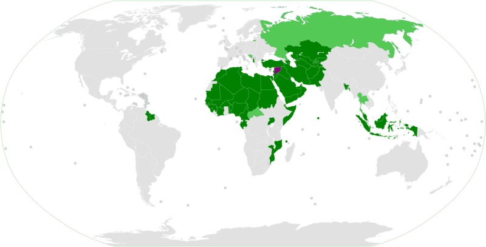

# Project Title

An analysis of Universal Basic Income for former Territories of the Ottoman Empire- comprising 57 nation-states, and how emerging blockchain technologies can be used to regulate the institutional Requirements of the Ottoman Islamic legal framework, specifically the Requirements of Commodity or Commodity-Backed Monetary Systems.

The Calculator app is developed as a first phase in understanding the interdependencies between currencies used to price certain commodities which maybe used a inputs for a furture  coin. 

---

## Technologies

>##### Python
>##### numpy
>##### Pandas

---

## Installation Guide

For non technical users, click on colab.research.google.com then upload and run the UBI_PROJECT folder in google colabs. 

---

## Usage

Calculator- CLI Interface is a tool for users to analyze relationship between the price of certain commodities used to manufacture U.S. coins and the respective commodities priced in USD, to include:

>##### A list of U.S. coins currently used as legal tender.
>##### Percentage Breakdown of the metals used to mint both historical and existing U.S. coins.
>##### Current prices of metals/ commodities used to manufacture coins. 
>##### Seigneuriage Calculator or Melt Value vs Face Value [Link](./UBI_PROJECT/calculator.ipynb) 

---

## License

Fintech3109 Copyright 2021
